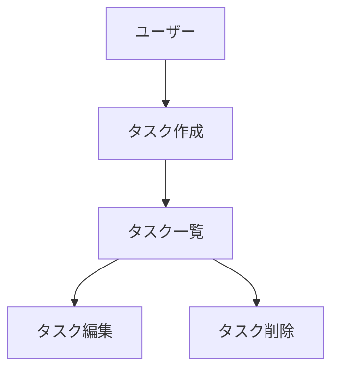

# CLAUDE.md

このファイルは Claude Code (claude.ai/code) がこのリポジトリで作業する際のガイダンスを提供する。

---

## クイックリファレンス

### プロジェクト概要

日記サービス「Reflect Forward」- 振り返りと AI 分析で自己理解を支援

### 技術スタック

| カテゴリ       | 技術                                                |
| -------------- | --------------------------------------------------- |
| モノレポ       | Turborepo + pnpm (v9.15.0)                          |
| フロントエンド | Next.js 15 (App Router) + TypeScript + Tailwind CSS |
| バックエンド   | Hono                                                |
| 認証           | JWT 自前実装                                        |
| DB             | PostgreSQL (Supabase 本番 / Docker ローカル)        |
| ORM            | Prisma                                              |
| バリデーション | Zod                                                 |
| テスト         | Vitest                                              |

### ディレクトリ構成

```
apps/
  web/           → Next.js フロントエンド
  api/           → Hono バックエンド
    prisma/      → Prisma スキーマ・マイグレーション
packages/
  shared/        → 共通の型定義・Zod スキーマ
docs/            → 永続的ドキュメント
.steering/       → 作業単位のドキュメント
```

### よく使うコマンド

```bash
pnpm dev              # 全アプリ起動
pnpm build            # ビルド
pnpm test             # テスト
pnpm lint             # リント
pnpm format           # フォーマット

# Prisma（apps/api で実行）
cd apps/api
pnpm prisma generate  # クライアント生成
pnpm prisma db push   # スキーマ反映
pnpm prisma studio    # DB 管理画面

# Docker
docker-compose up -d  # PostgreSQL 起動
```

### 重要なファイル

- `apps/api/prisma/schema.prisma` - DB スキーマ定義
- `packages/shared/src/validations/` - Zod バリデーション
- `packages/shared/src/types/` - 共有型定義
- `.env.example` - 環境変数テンプレート

---

## MCP サーバー

### 概要

このプロジェクトでは以下の MCP サーバーを利用可能。

| サーバー   | 用途                           | 備考             |
| ---------- | ------------------------------ | ---------------- |
| GitHub     | Issue/PR操作、ブランチ管理     | GITHUB_TOKEN必須 |
| PostgreSQL | スキーマ確認、クエリ実行       | 読み取り専用     |
| Context7   | 最新ライブラリドキュメント取得 | 追加設定不要     |

### セットアップ

1. **GitHub Personal Access Token の作成**
   - https://github.com/settings/tokens で新しいトークンを作成
   - 必要なスコープ: `repo`, `read:org`, `read:user`

2. **環境変数の設定**

   ```bash
   # .env ファイルに追加
   GITHUB_TOKEN=ghp_your_actual_token_here
   ```

3. **動作確認**
   ```bash
   # MCP サーバー一覧を確認
   claude mcp list
   ```

### 利用例

**GitHub MCP:**

- リポジトリのIssue一覧を取得
- PRの情報を確認
- ブランチ状況の把握

**PostgreSQL MCP:**

- テーブル一覧の取得
- スキーマ情報の確認
- データの参照（読み取り専用）

**Context7 MCP:**

- Next.js、Prisma、Honoなどの最新ドキュメントを参照
- バージョン固有の正確な情報を取得
- 「use context7」を含むプロンプトでドキュメント参照を有効化

### 注意事項

- PostgreSQL MCPは読み取り専用モードで運用（安全性のため）
- 本番データベースへの接続は避け、ローカルDocker環境を使用すること
- GITHUB_TOKENは最小権限スコープで作成し、定期的にローテーションすること

---

## ドキュメント管理

### ドキュメントの分類

#### 永続的ドキュメント（`docs`）

アプリケーション全体の「**何を作るか**」「**なぜ作るのか**」「**どう作るのか**」を定義する恒久的なドキュメント。
アプリケーションの基本設計や方針は変わらない限り更新されない。

##### product-requirements.md - プロダクト要求定義書

- プロダクトビジョンと目的
- ターゲットユーザーと課題・ニーズ
- 主要な機能一覧
- 成功の定義
- ユーザーストーリー
- 機能要件
- 非機能要件
- 受け入れ条件
- 優先順位

##### functional-design.md - 機能設計書

- 機能ごとのアーキテクチャ
- システム構成図
- データモデル定義（ER図含む）
- コンポーネント設計
- ユースケース図
- 画面遷移図
- ワイヤーフレーム
- API設計

##### architecture.md - 技術仕様書

- テクノロジースタック
- 開発ツールと手法
- 技術的誓約と要件
- パフォーマンス要件

##### repository-structure.md - リポジトリ構造定義書

- フォルダ・ファイル構成
- ディレクトリの役割
- ファイル配置ルール

##### development-guidelines.md - 開発ガイドライン

- コーディング規約
- 命名規則
- スタイリング規約
- テスト規約
- Git規約

#### 作業単位のドキュメント（`.steering/[YYYYMMDD]-[開発タイトル]`）

特定の開発作業における「**今回何をするか**」を定義する一時的なステアリングファイル。
作業完了後は参照用として保持されるが、新しい作業では新しいディレクトリを作成する。

##### requirements.md - 今回の作業の要求内容

- 変更・追加する機能の説明
- ユーザーストーリー
- 制約事項

##### design.md - 変更内容の設計

- 実装アプローチ
- 変更するコンポーネント
- データ構造の変更
- 影響範囲の分析

##### tasklist.md - タスクリスト

- 具体的な実装タスク
- タスクの進捗状況
- 完了条件

### ステアリングファイルの命名規則

```
.steering/[YYYYMMDD]-[開発タイトル]/
```

**例：**

- `.steering/20260103-setup-authentication/`
- `.steering/20260103-refactor-database-schema/`
- `.steering/20260103-integrate-payment-api/`
- `.steering/20260103-update-ui-components/`

## 開発プロセス

### 初回セットアップ時の手順

#### フォルダ作成

```bash
mkdir -p docs
mkdir -p .steering
```

#### 永続的ドキュメントの作成（`docs`）

アプリケーション全体の設計を定義する。
各ドキュメントを作成後、必ず確認・承認を得てから次に進む。

1. `docs/product-requirements.md` - プロダクト要求定義書
2. `docs/functional-design.md` - 機能設計書
3. `docs/architecture.md` - 技術仕様書
4. `docs/repository-structure.md` - リポジトリ構造定義書
5. `docs/development-guidelines.md` - 開発ガイドライン

**重要：** 1ファイルごとに作成後、必ず確認・承認を得てから次のファイル作成を行う

#### 初回実装用のステアリングファイル作成

初回実装用のディレクトリを作成し、実装に必要なドキュメントを配置する。

```bash
mkdir -p .steering/[YYYYMMDD]-initial-implementation
```

作成するドキュメント：

1. `steering/[YYYYMMDD]-initial-implementation/requirements.md` - 初回実装の要求
2. `.steering/[YYYYMMDD]-initial-implementation/design.md` - 実装設計
3. `.steering/[YYYYMMDD]-initial-implementation/tasklist.md` - 実装タスク

#### 環境セットアップ

#### 実装開始

`.steering/[YYYYMMDD]-initial-implementation/tasklist.md`に基づいて実装を進める。

#### 品質チェック

### 機能追加・修正時の手順

#### 影響分析

- 永続的ドキュメント（`docs/`）への影響を確認
- 変更が基本設計に影響する場合は `docs/` を更新

#### ステアリングディレクトリの作成

新しい作業用のディレクトリを作成する。

```bash
mkdir -p .steering/[YYYYMMDD]-[開発タイトル]
```

**例：**

```bash
mkdir -p .steering/20260515-update-ui-component
```

#### 作業ドキュメントの作成

作業単位のドキュメントを作成する。
各ドキュメント作成後、必ず確認・承認を得てから次に進む。

1. `.steering/[YYYYMMDD]-[開発タイトル]/requirements.md` - 要求内容
2. `.steering/[YYYYMMDD]-[開発タイトル]/design.md` - 設計
3. `.steering/[YYYYMMDD]-[開発タイトル]/tasklist.md` - タスクリスト

**重要：** 1ファイルごとに作成後、必ず確認・承認を得てから次のファイル作成を行う

#### 永続的ドキュメントの更新（必要な場合のみ）

変更が基本設計に影響する場合、該当する `docs/` 内のドキュメント更新する。

#### 実装開始

`.steering/[YYYYMMDD]-[開発タイトル]/tasklist.md` に基づいて実装を進める。

#### 品質チェック

## ドキュメント管理の原則

### 永続的ドキュメント（`docs/`）

- アプリケーションの基本設計を記述
- 頻繁に更新されない
- 大きな設計変更時のみ更新
- プロジェクト全体の向かうべき指針

### 作業単位のドキュメント（`.steering/`）

- 特定の作業・変更に特化
- 作業ごとに新しいディレクトリを作成
- 作業完了後は履歴として保持
- 変更の意図と経緯を記録

## 図表・ダイアグラムの記載ルール

### 記載場所

設計図やダイアグラムは。関連する永続ドキュメント内に直接記載する。
独立した diagrams フォルダは作成せず、手間を最小限に抑える。

**配置例：**

- ER図、データモデル図 → `functional-design.md` 内に記載
- ユースケース図 → `functional-design.md` または `product-requirements.md` 内に記載
- 画面遷移図、ワイヤーフレーム → `functional-design.md` 内に記載
- システム構成図 → `functional-design.md` または `architecture.md` 内に記載

### 記述形式

1. **Mermaid記法（推奨）**

- Markdownに直接埋め込める
- バージョン管理が容易
- ツール不要で編集可能



2. **ASCII アート**
   　 - シンプルな図表に使用
   　 - テキストエディタで編集可能

```
┌─────────────┐
│　 Header    │
└─────────────┘
　　　 │
　　　 ↓
┌─────────────┐
│　Task List  │
└─────────────┘
```

3. **画像ファイル（必要な場合のみ）**
   　 - 複雑なワイヤフレームやモックアップ
   　 - `docs/images/` フォルダに配置
   　 - PNG または SVG 形式を推奨

### 図表の更新

- 設計変更時は対応する図表も同時に更新
- 図表とコードの乖離を防ぐ

## 注意事項

- ドキュメントの作成・更新は段階的に行い、各段階で承認を得る
- `.steering/` のディレクトリ名は日付と開発タイトルで明確に識別できるようにする
- 永続的ドキュメントと作業単位のドキュメントを混同しない
- コード変更後は必ずリント・型チェックを実施する
- 共通のデザインシステム（Tailwind CSS）を使用して統一感を保つ
- セキュリティを考慮したコーディング（XSS対策、入力バリデーションなど）
- 図表は必要最小限に留め、メンテナンスコストを抑える
