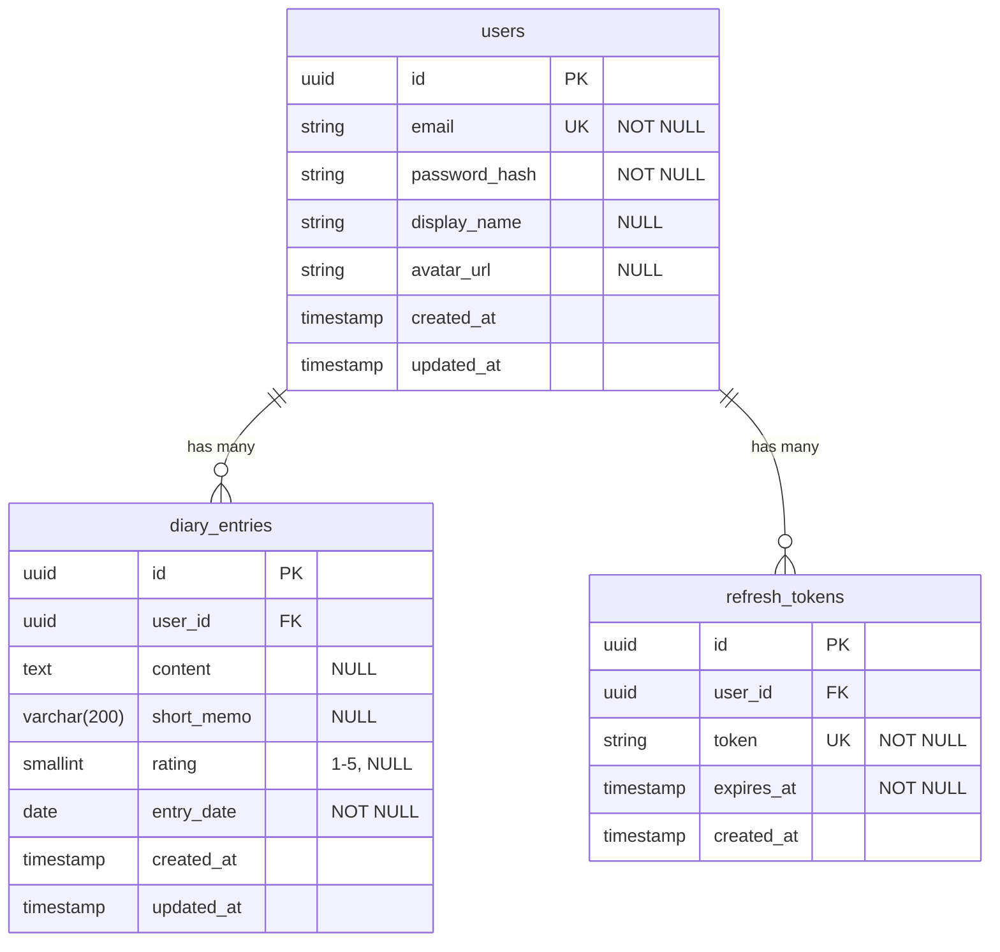
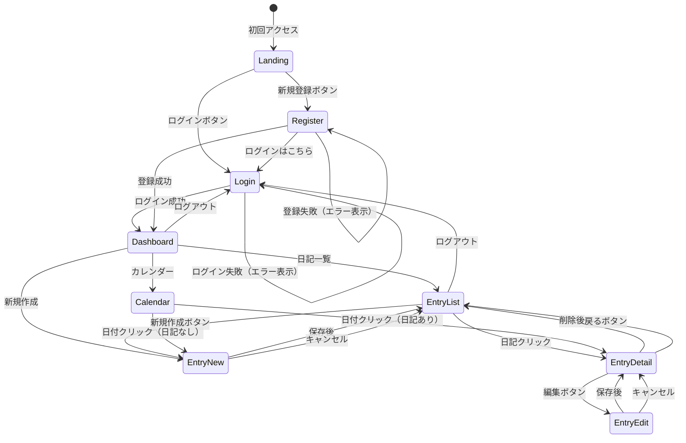

# Reflect Forward - 機能設計書

## 1. システム構成図

```
┌─────────────────────────────────────────────────────────────────┐
│                         Client (Browser)                        │
│  ┌───────────────────────────────────────────────────────────┐  │
│  │                    Next.js (App Router)                   │  │
│  │  ┌─────────────┐  ┌─────────────┐  ┌─────────────────┐   │  │
│  │  │  Auth Pages │  │ Entry Pages │  │   Components    │   │  │
│  │  │  - Login    │  │  - List     │  │  - AuthContext  │   │  │
│  │  │  - Register │  │  - Detail   │  │  - EntryForm    │   │  │
│  │  │             │  │  - Calendar │  │  - Calendar     │   │  │
│  │  └─────────────┘  └─────────────┘  └─────────────────┘   │  │
│  └───────────────────────────────────────────────────────────┘  │
│                              │                                   │
│                              │ HTTP (fetch)                      │
│                              │ Authorization: Bearer {token}     │
│                              │ Cookie: refreshToken              │
└──────────────────────────────┼───────────────────────────────────┘
                               │
                               ▼
┌─────────────────────────────────────────────────────────────────┐
│                         API Server                              │
│  ┌───────────────────────────────────────────────────────────┐  │
│  │                      Hono Framework                       │  │
│  │  ┌─────────────┐  ┌─────────────┐  ┌─────────────────┐   │  │
│  │  │  Middleware │  │   Routes    │  │      Lib        │   │  │
│  │  │  - CORS     │  │  - /auth    │  │  - JWT          │   │  │
│  │  │  - Logger   │  │  - /entries │  │  - Password     │   │  │
│  │  │  - Auth     │  │             │  │  - Prisma       │   │  │
│  │  └─────────────┘  └─────────────┘  └─────────────────┘   │  │
│  └───────────────────────────────────────────────────────────┘  │
│                              │                                   │
│                              │ Prisma Client                     │
└──────────────────────────────┼───────────────────────────────────┘
                               │
                               ▼
┌─────────────────────────────────────────────────────────────────┐
│                       PostgreSQL (Supabase)                     │
│  ┌─────────────┐  ┌─────────────────┐  ┌─────────────────┐     │
│  │    users    │  │  diary_entries  │  │ refresh_tokens  │     │
│  └─────────────┘  └─────────────────┘  └─────────────────┘     │
└─────────────────────────────────────────────────────────────────┘
```

---

## 2. データモデル（ER図）



### インデックス

| テーブル       | カラム                | 目的                                       |
| -------------- | --------------------- | ------------------------------------------ |
| diary_entries  | (user_id, entry_date) | ユーザーの日記一覧・カレンダー取得の高速化 |
| refresh_tokens | expires_at            | 期限切れトークンの削除バッチ処理           |

---

## 3. 画面遷移図



---

## 4. 画面一覧・ワイヤーフレーム

### 4.1 ログイン画面 (`/login`)

```
┌─────────────────────────────────────────┐
│              Reflect Forward            │
│                                         │
│  ┌───────────────────────────────────┐  │
│  │                                   │  │
│  │         ログイン                  │  │
│  │                                   │  │
│  │  メールアドレス                   │  │
│  │  ┌─────────────────────────────┐  │  │
│  │  │ example@email.com           │  │  │
│  │  └─────────────────────────────┘  │  │
│  │                                   │  │
│  │  パスワード                       │  │
│  │  ┌─────────────────────────────┐  │  │
│  │  │ ••••••••                    │  │  │
│  │  └─────────────────────────────┘  │  │
│  │                                   │  │
│  │  ┌─────────────────────────────┐  │  │
│  │  │         ログイン            │  │  │
│  │  └─────────────────────────────┘  │  │
│  │                                   │  │
│  │  アカウントをお持ちでない方は     │  │
│  │  [新規登録はこちら]               │  │
│  │                                   │  │
│  └───────────────────────────────────┘  │
│                                         │
└─────────────────────────────────────────┘
```

### 4.2 新規登録画面 (`/register`)

```
┌─────────────────────────────────────────┐
│              Reflect Forward            │
│                                         │
│  ┌───────────────────────────────────┐  │
│  │                                   │  │
│  │         新規登録                  │  │
│  │                                   │  │
│  │  メールアドレス                   │  │
│  │  ┌─────────────────────────────┐  │  │
│  │  │                             │  │  │
│  │  └─────────────────────────────┘  │  │
│  │                                   │  │
│  │  パスワード（8文字以上）          │  │
│  │  ┌─────────────────────────────┐  │  │
│  │  │                             │  │  │
│  │  └─────────────────────────────┘  │  │
│  │                                   │  │
│  │  表示名（任意）                   │  │
│  │  ┌─────────────────────────────┐  │  │
│  │  │                             │  │  │
│  │  └─────────────────────────────┘  │  │
│  │                                   │  │
│  │  ┌─────────────────────────────┐  │  │
│  │  │         登録する            │  │  │
│  │  └─────────────────────────────┘  │  │
│  │                                   │  │
│  │  すでにアカウントをお持ちの方は   │  │
│  │  [ログインはこちら]               │  │
│  │                                   │  │
│  └───────────────────────────────────┘  │
│                                         │
└─────────────────────────────────────────┘
```

### 4.3 ダッシュボード (`/dashboard`)

```
┌─────────────────────────────────────────────────────────────┐
│  Reflect Forward                          [User] [Logout]   │
├─────────────────────────────────────────────────────────────┤
│                                                             │
│  ようこそ、{displayName}さん                                │
│                                                             │
│  ┌─────────────────┐  ┌─────────────────┐                   │
│  │                 │  │                 │                   │
│  │   📝 日記を     │  │   📅 カレンダー │                   │
│  │   書く          │  │   を見る        │                   │
│  │                 │  │                 │                   │
│  └─────────────────┘  └─────────────────┘                   │
│                                                             │
│  ─────────────────────────────────────────────────────────  │
│                                                             │
│  最近の日記                              [すべて見る →]     │
│                                                             │
│  ┌─────────────────────────────────────────────────────┐   │
│  │ 2026/02/04  ★★★★☆                                  │   │
│  │ 今日は良い一日だった...                              │   │
│  └─────────────────────────────────────────────────────┘   │
│  ┌─────────────────────────────────────────────────────┐   │
│  │ 2026/02/03  ★★★☆☆                                  │   │
│  │ 少し疲れた...                                        │   │
│  └─────────────────────────────────────────────────────┘   │
│                                                             │
└─────────────────────────────────────────────────────────────┘
```

### 4.4 日記一覧 (`/entries`)

```
┌─────────────────────────────────────────────────────────────┐
│  Reflect Forward                          [User] [Logout]   │
├─────────────────────────────────────────────────────────────┤
│                                                             │
│  日記一覧                                 [+ 新規作成]      │
│                                                             │
│  ┌─────────────────────────────────────────────────────┐   │
│  │ 2026/02/04 (火)                           ★★★★☆  │   │
│  │ 今日は良い一日だった。朝から調子が良くて...          │   │
│  └─────────────────────────────────────────────────────┘   │
│                                                             │
│  ┌─────────────────────────────────────────────────────┐   │
│  │ 2026/02/03 (月)                           ★★★☆☆  │   │
│  │ 少し疲れた。でも、やるべきことはできた...            │   │
│  └─────────────────────────────────────────────────────┘   │
│                                                             │
│  ┌─────────────────────────────────────────────────────┐   │
│  │ 2026/02/02 (日)                           ★★★★★  │   │
│  │ 休日をゆっくり過ごせた。本を読んで...                │   │
│  └─────────────────────────────────────────────────────┘   │
│                                                             │
│                    [< 前へ] [1] [2] [3] [次へ >]            │
│                                                             │
└─────────────────────────────────────────────────────────────┘
```

### 4.5 日記作成・編集 (`/entries/new`, `/entries/:id/edit`)

```
┌─────────────────────────────────────────────────────────────┐
│  Reflect Forward                          [User] [Logout]   │
├─────────────────────────────────────────────────────────────┤
│                                                             │
│  [← 戻る]                                                   │
│                                                             │
│  日記を書く                                                 │
│                                                             │
│  日付                                                       │
│  ┌─────────────────────────────────────────────────────┐   │
│  │ 2026-02-04                                     [📅] │   │
│  └─────────────────────────────────────────────────────┘   │
│                                                             │
│  今日の調子は？                                             │
│  ┌─────────────────────────────────────────────────────┐   │
│  │    ☆      ☆      ★      ★      ★                 │   │
│  │    1      2      3      4      5                    │   │
│  └─────────────────────────────────────────────────────┘   │
│                                                             │
│  一言メモ（200文字以内）                                    │
│  ┌─────────────────────────────────────────────────────┐   │
│  │ 今日は良い一日だった                                │   │
│  └─────────────────────────────────────────────────────┘   │
│                                                             │
│  本文（任意）                                               │
│  ┌─────────────────────────────────────────────────────┐   │
│  │                                                     │   │
│  │ 朝から調子が良くて、仕事もはかどった。              │   │
│  │ 昼休みに少し散歩したのが良かったのかも。            │   │
│  │                                                     │   │
│  │                                                     │   │
│  └─────────────────────────────────────────────────────┘   │
│                                                             │
│        [キャンセル]                      [保存する]         │
│                                                             │
└─────────────────────────────────────────────────────────────┘
```

### 4.6 日記詳細 (`/entries/:id`)

```
┌─────────────────────────────────────────────────────────────┐
│  Reflect Forward                          [User] [Logout]   │
├─────────────────────────────────────────────────────────────┤
│                                                             │
│  [← 一覧に戻る]                                             │
│                                                             │
│  2026年2月4日（火）                        ★★★★☆        │
│                                                             │
│  ─────────────────────────────────────────────────────────  │
│                                                             │
│  今日は良い一日だった                                       │
│                                                             │
│  ─────────────────────────────────────────────────────────  │
│                                                             │
│  朝から調子が良くて、仕事もはかどった。                     │
│  昼休みに少し散歩したのが良かったのかも。                   │
│                                                             │
│  夜は早めに寝て、明日も頑張ろう。                           │
│                                                             │
│  ─────────────────────────────────────────────────────────  │
│                                                             │
│        [編集]                              [削除]           │
│                                                             │
└─────────────────────────────────────────────────────────────┘
```

### 4.7 カレンダー (`/entries/calendar`)

```
┌─────────────────────────────────────────────────────────────┐
│  Reflect Forward                          [User] [Logout]   │
├─────────────────────────────────────────────────────────────┤
│                                                             │
│           [<]     2026年2月     [>]                         │
│                                                             │
│  ┌─────┬─────┬─────┬─────┬─────┬─────┬─────┐               │
│  │ 日  │ 月  │ 火  │ 水  │ 木  │ 金  │ 土  │               │
│  ├─────┼─────┼─────┼─────┼─────┼─────┼─────┤               │
│  │     │     │     │     │     │     │  1  │               │
│  │     │     │     │     │     │     │ ★3 │               │
│  ├─────┼─────┼─────┼─────┼─────┼─────┼─────┤               │
│  │  2  │  3  │  4  │  5  │  6  │  7  │  8  │               │
│  │ ★5 │ ★3 │ ★4 │     │     │     │     │               │
│  ├─────┼─────┼─────┼─────┼─────┼─────┼─────┤               │
│  │  9  │ 10  │ 11  │ 12  │ 13  │ 14  │ 15  │               │
│  │     │     │     │     │     │     │     │               │
│  ├─────┼─────┼─────┼─────┼─────┼─────┼─────┤               │
│  │ 16  │ 17  │ 18  │ 19  │ 20  │ 21  │ 22  │               │
│  │     │     │     │     │     │     │     │               │
│  ├─────┼─────┼─────┼─────┼─────┼─────┼─────┤               │
│  │ 23  │ 24  │ 25  │ 26  │ 27  │ 28  │     │               │
│  │     │     │     │     │     │     │     │               │
│  └─────┴─────┴─────┴─────┴─────┴─────┴─────┘               │
│                                                             │
│  ★ = 評価（1-5）、クリックで日記を表示                      │
│                                                             │
└─────────────────────────────────────────────────────────────┘
```

---

## 5. コンポーネント設計

### 5.1 フロントエンド コンポーネント構成

```
apps/web/src/
├── app/
│   ├── (auth)/                    # 認証不要ページ
│   │   ├── login/page.tsx
│   │   ├── register/page.tsx
│   │   └── layout.tsx
│   ├── (protected)/               # 認証必要ページ
│   │   ├── dashboard/page.tsx
│   │   ├── entries/
│   │   │   ├── page.tsx           # 一覧
│   │   │   ├── new/page.tsx       # 新規作成
│   │   │   ├── [id]/page.tsx      # 詳細
│   │   │   ├── [id]/edit/page.tsx # 編集
│   │   │   └── calendar/page.tsx  # カレンダー
│   │   └── layout.tsx
│   ├── layout.tsx
│   └── page.tsx                   # ランディング or リダイレクト
├── components/
│   ├── ui/                        # 汎用UIコンポーネント
│   │   ├── Button.tsx
│   │   ├── Input.tsx
│   │   ├── Card.tsx
│   │   ├── Modal.tsx
│   │   └── Spinner.tsx
│   ├── auth/                      # 認証関連
│   │   ├── LoginForm.tsx
│   │   ├── RegisterForm.tsx
│   │   └── LogoutButton.tsx
│   ├── entries/                   # 日記関連
│   │   ├── EntryList.tsx
│   │   ├── EntryCard.tsx
│   │   ├── EntryForm.tsx
│   │   ├── EntryDetail.tsx
│   │   ├── Calendar.tsx
│   │   ├── RatingStars.tsx
│   │   └── Pagination.tsx
│   └── layout/                    # レイアウト
│       ├── Header.tsx
│       ├── Navigation.tsx
│       └── Footer.tsx
├── contexts/
│   └── AuthContext.tsx            # 認証状態管理
├── hooks/
│   ├── useAuth.ts                 # 認証操作
│   └── useEntries.ts              # 日記操作
└── lib/
    ├── api.ts                     # APIクライアント
    └── utils.ts                   # ユーティリティ
```

### 5.2 主要コンポーネント仕様

#### AuthContext

| 項目     | 内容                                                  |
| -------- | ----------------------------------------------------- |
| 状態     | `user`, `accessToken`, `isLoading`, `isAuthenticated` |
| メソッド | `login()`, `register()`, `logout()`, `refreshToken()` |
| 用途     | アプリ全体で認証状態を共有                            |

#### EntryForm

| Props          | 型                        | 説明                     |
| -------------- | ------------------------- | ------------------------ |
| `mode`         | `'create' \| 'edit'`      | 作成/編集モード          |
| `initialData?` | `DiaryEntry`              | 編集時の初期値           |
| `onSubmit`     | `(data) => Promise<void>` | 送信時コールバック       |
| `onCancel`     | `() => void`              | キャンセル時コールバック |

#### Calendar

| Props           | 型                       | 説明               |
| --------------- | ------------------------ | ------------------ |
| `year`          | `number`                 | 表示年             |
| `month`         | `number`                 | 表示月（1-12）     |
| `entries`       | `CalendarEntry[]`        | 日付ごとの記録情報 |
| `onDateClick`   | `(date: string) => void` | 日付クリック時     |
| `onMonthChange` | `(year, month) => void`  | 月変更時           |

#### RatingStars

| Props       | 型                        | 説明                 |
| ----------- | ------------------------- | -------------------- |
| `value`     | `number \| null`          | 現在の評価（1-5）    |
| `onChange?` | `(value: number) => void` | 変更時（編集モード） |
| `readonly?` | `boolean`                 | 読み取り専用         |
| `size?`     | `'sm' \| 'md' \| 'lg'`    | サイズ               |

---

## 6. API 詳細設計

### 6.1 認証API

#### POST `/api/auth/register`

ユーザー登録

**Request**

```json
{
  "email": "user@example.com",
  "password": "password123",
  "displayName": "ユーザー名" // optional
}
```

**Response (201)**

```json
{
  "user": {
    "id": "uuid",
    "email": "user@example.com",
    "displayName": "ユーザー名",
    "avatarUrl": null,
    "createdAt": "2026-02-04T10:00:00.000Z",
    "updatedAt": "2026-02-04T10:00:00.000Z"
  },
  "accessToken": "eyJhbGciOiJIUzI1NiIs..."
}
```

- Set-Cookie: `refreshToken=xxx; HttpOnly; Secure; SameSite=Strict; Path=/; Max-Age=604800`

**Error Response (409)**

```json
{
  "error": "このメールアドレスは既に登録されています"
}
```

#### POST `/api/auth/login`

ログイン

**Request**

```json
{
  "email": "user@example.com",
  "password": "password123"
}
```

**Response (200)**

```json
{
  "user": {
    "id": "uuid",
    "email": "user@example.com",
    "displayName": "ユーザー名",
    "avatarUrl": null,
    "createdAt": "2026-02-04T10:00:00.000Z",
    "updatedAt": "2026-02-04T10:00:00.000Z"
  },
  "accessToken": "eyJhbGciOiJIUzI1NiIs..."
}
```

- Set-Cookie: `refreshToken=xxx; HttpOnly; Secure; SameSite=Strict; Path=/; Max-Age=604800`

**Error Response (401)**

```json
{
  "error": "メールアドレスまたはパスワードが正しくありません"
}
```

#### POST `/api/auth/refresh`

トークン更新

**Request**

- Cookie: `refreshToken=xxx`

**Response (200)**

```json
{
  "accessToken": "eyJhbGciOiJIUzI1NiIs..."
}
```

- Set-Cookie: `refreshToken=newxxx; HttpOnly; Secure; SameSite=Strict; Path=/; Max-Age=604800`

**Error Response (401)**

```json
{
  "error": "セッションの有効期限が切れました"
}
```

#### POST `/api/auth/logout`

ログアウト

**Request**

- Header: `Authorization: Bearer {accessToken}`

**Response (200)**

```json
{
  "message": "ログアウトしました"
}
```

- Set-Cookie: `refreshToken=; HttpOnly; Secure; SameSite=Strict; Path=/; Max-Age=0`

#### GET `/api/auth/me`

現在のユーザー取得

**Request**

- Header: `Authorization: Bearer {accessToken}`

**Response (200)**

```json
{
  "user": {
    "id": "uuid",
    "email": "user@example.com",
    "displayName": "ユーザー名",
    "avatarUrl": null,
    "createdAt": "2026-02-04T10:00:00.000Z",
    "updatedAt": "2026-02-04T10:00:00.000Z"
  }
}
```

### 6.2 日記API

#### GET `/api/entries`

日記一覧取得

**Request**

- Header: `Authorization: Bearer {accessToken}`
- Query: `?page=1&limit=20&from=2026-01-01&to=2026-02-28&rating=4`

**Response (200)**

```json
{
  "entries": [
    {
      "id": "uuid",
      "content": "今日は良い一日だった...",
      "shortMemo": "良い一日",
      "rating": 4,
      "entryDate": "2026-02-04",
      "createdAt": "2026-02-04T22:00:00.000Z",
      "updatedAt": "2026-02-04T22:00:00.000Z"
    }
  ],
  "pagination": {
    "page": 1,
    "limit": 20,
    "total": 45,
    "totalPages": 3
  }
}
```

#### POST `/api/entries`

日記作成

**Request**

```json
{
  "content": "今日は良い一日だった...",
  "shortMemo": "良い一日",
  "rating": 4,
  "entryDate": "2026-02-04"
}
```

**Response (201)**

```json
{
  "entry": {
    "id": "uuid",
    "content": "今日は良い一日だった...",
    "shortMemo": "良い一日",
    "rating": 4,
    "entryDate": "2026-02-04",
    "createdAt": "2026-02-04T22:00:00.000Z",
    "updatedAt": "2026-02-04T22:00:00.000Z"
  }
}
```

#### GET `/api/entries/:id`

日記詳細取得

**Response (200)**

```json
{
  "entry": {
    "id": "uuid",
    "content": "今日は良い一日だった...",
    "shortMemo": "良い一日",
    "rating": 4,
    "entryDate": "2026-02-04",
    "createdAt": "2026-02-04T22:00:00.000Z",
    "updatedAt": "2026-02-04T22:00:00.000Z"
  }
}
```

**Error Response (404)**

```json
{
  "error": "日記が見つかりません"
}
```

#### PUT `/api/entries/:id`

日記更新

**Request**

```json
{
  "content": "更新後の内容...",
  "shortMemo": "更新メモ",
  "rating": 5
}
```

**Response (200)**

```json
{
  "entry": {
    "id": "uuid",
    "content": "更新後の内容...",
    "shortMemo": "更新メモ",
    "rating": 5,
    "entryDate": "2026-02-04",
    "createdAt": "2026-02-04T22:00:00.000Z",
    "updatedAt": "2026-02-04T23:00:00.000Z"
  }
}
```

#### DELETE `/api/entries/:id`

日記削除

**Response (200)**

```json
{
  "message": "日記を削除しました"
}
```

#### GET `/api/entries/calendar`

カレンダー用データ取得

**Request**

- Query: `?year=2026&month=2`

**Response (200)**

```json
{
  "entries": [
    { "date": "2026-02-01", "count": 1, "avgRating": 3 },
    { "date": "2026-02-02", "count": 1, "avgRating": 5 },
    { "date": "2026-02-03", "count": 2, "avgRating": 3.5 },
    { "date": "2026-02-04", "count": 1, "avgRating": 4 }
  ]
}
```

---

## 7. 認証フロー詳細

### 7.1 初回アクセス時

```
1. ユーザーがサイトにアクセス
2. AuthContext が初期化
3. /api/auth/refresh を呼び出し（Cookie の refreshToken を送信）
   - 成功: accessToken を取得、ユーザー情報を取得、認証状態に
   - 失敗: 未認証状態に、ログインページへ
```

### 7.2 API リクエスト時

```
1. APIクライアントが Authorization ヘッダーに accessToken を付与
2. サーバーが JWT を検証
   - 有効: リクエスト処理
   - 期限切れ: 401 を返す
3. クライアントが 401 を受信
4. /api/auth/refresh を呼び出し
   - 成功: 新しい accessToken で元のリクエストをリトライ
   - 失敗: ログインページへリダイレクト
```

### 7.3 リフレッシュトークン ローテーション

```
1. /api/auth/refresh が呼ばれる
2. Cookie の refreshToken を検証
3. DB で refreshToken の存在と有効期限を確認
4. 新しい refreshToken を生成
5. 古い refreshToken を削除、新しいものを保存
6. 新しい accessToken と refreshToken（Cookie）を返す
```

---

## 8. エラーハンドリング

### 8.1 HTTPステータスコード

| コード | 用途                                   |
| ------ | -------------------------------------- |
| 200    | 成功（取得、更新、削除）               |
| 201    | 成功（作成）                           |
| 400    | バリデーションエラー                   |
| 401    | 認証エラー（未認証、トークン期限切れ） |
| 404    | リソースが見つからない                 |
| 409    | 競合（メールアドレス重複など）         |
| 500    | サーバーエラー                         |

### 8.2 エラーレスポンス形式

```json
{
  "error": "エラーメッセージ",
  "details": [
    {
      "field": "email",
      "message": "有効なメールアドレスを入力してください"
    }
  ]
}
```

### 8.3 フロントエンドでのエラー表示

| エラー種別           | 表示方法                           |
| -------------------- | ---------------------------------- |
| バリデーションエラー | フォームフィールドの下に赤字で表示 |
| 認証エラー           | フォーム上部にアラート表示         |
| ネットワークエラー   | トースト通知                       |
| 404エラー            | エラーページに遷移                 |
| 500エラー            | 「問題が発生しました」ページに遷移 |

---

## 9. セキュリティ設計

### 9.1 認証セキュリティ

#### JWT仕様

| 項目             | 値                       |
| ---------------- | ------------------------ |
| 署名アルゴリズム | HS256（HMAC SHA-256）    |
| 有効期限         | 15分                     |
| 保存場所         | メモリ（JavaScript変数） |

**ペイロード構造**

```json
{
  "sub": "user-uuid",
  "email": "user@example.com",
  "iat": 1738659600,
  "exp": 1738660500
}
```

**実装時の注意**

- `alg: none` 攻撃を防ぐため、検証時にアルゴリズムを明示的に指定
- シークレットキーは32文字以上のランダム文字列

#### パスワードポリシー

| 項目                 | 要件    |
| -------------------- | ------- |
| 最小文字数           | 8文字   |
| 最大文字数           | 100文字 |
| ハッシュアルゴリズム | bcrypt  |
| bcryptコスト         | 10      |

**将来的な強化（MVP後）**

- 大文字・小文字・数字の組み合わせ要件
- パスワード強度メーター

#### ログイン試行回数制限

| 項目             | 値                          |
| ---------------- | --------------------------- |
| 最大試行回数     | 5回                         |
| ロックアウト期間 | 15分                        |
| カウントリセット | ログイン成功時              |
| 制限単位         | IPアドレス + メールアドレス |

**実装方法**

- インメモリキャッシュ（Map）で試行回数を管理
- MVP後にRedis等への移行を検討

**エラーレスポンス（429 Too Many Requests）**

```json
{
  "error": "ログイン試行回数が上限に達しました。15分後に再試行してください。"
}
```

#### アカウント列挙攻撃対策

- 登録時のエラーメッセージは具体的に返す（UX優先）
- ログイン失敗時は「メールアドレスまたはパスワードが正しくありません」で統一
- レート制限で緩和

### 9.2 リフレッシュトークン設計

#### 基本仕様

| 項目                     | 値                                   |
| ------------------------ | ------------------------------------ |
| 形式                     | UUID v4                              |
| 有効期限                 | 7日                                  |
| 保存場所（クライアント） | HttpOnly Cookie                      |
| 保存場所（サーバー）     | PostgreSQL（refresh_tokensテーブル） |

#### Cookie属性

| 属性     | 本番環境      | 開発環境      |
| -------- | ------------- | ------------- |
| HttpOnly | true          | true          |
| Secure   | true          | false         |
| SameSite | Strict        | Lax           |
| Path     | /             | /             |
| Max-Age  | 604800（7日） | 604800（7日） |

#### レースコンディション対策

複数タブで同時にリフレッシュリクエストが発生した場合の対策：

```
1. リフレッシュリクエスト受信
2. 現在のトークンをDBで検索
3. トークンが存在し、有効期限内の場合：
   a. 新しいトークンを生成・保存
   b. 古いトークンに「猶予期間」を設定（10秒後に無効化）
   c. 新しいアクセストークンとリフレッシュトークンを返却
4. トークンが猶予期間中の場合：
   a. 同じユーザーの最新トークンを取得
   b. 新しいアクセストークンのみを返却（Cookieは更新しない）
5. トークンが無効または期限切れの場合：
   a. 401エラーを返却
```

**DBスキーマ変更（猶予期間対応）**

```sql
ALTER TABLE refresh_tokens ADD COLUMN invalidated_at TIMESTAMP NULL;
```

**トークン有効判定**

```
有効 = expires_at > NOW() AND (invalidated_at IS NULL OR invalidated_at > NOW())
```

### 9.3 CSRF対策

| 対策             | 実装                          |
| ---------------- | ----------------------------- |
| SameSite Cookie  | Strict（本番）/ Lax（開発）   |
| カスタムヘッダー | Authorization: Bearer {token} |
| Origin検証       | CORS設定で許可オリジンを制限  |

**補足**

- リフレッシュエンドポイントはCookieのみで認証するため、SameSite属性が重要
- 状態変更API（POST/PUT/DELETE）はAuthorizationヘッダー必須

### 9.4 メールアドレス正規化

| 処理           | 内容                                    |
| -------------- | --------------------------------------- |
| 小文字変換     | `User@Example.COM` → `user@example.com` |
| 前後の空白除去 | `user@example.com` → `user@example.com` |
| 適用タイミング | 登録時、ログイン時の両方                |

---

## 10. 実装仕様

### 10.1 データフォーマット

| 項目              | フォーマット                   | 例                                     |
| ----------------- | ------------------------------ | -------------------------------------- |
| 日付（entryDate） | YYYY-MM-DD（ISO 8601日付部分） | `2026-02-04`                           |
| タイムスタンプ    | ISO 8601（UTC）                | `2026-02-04T22:00:00.000Z`             |
| UUID              | UUID v4                        | `550e8400-e29b-41d4-a716-446655440000` |

### 10.2 ページネーション

| 項目                   | 値               |
| ---------------------- | ---------------- |
| 方式                   | オフセットベース |
| デフォルトページサイズ | 20               |
| 最大ページサイズ       | 100              |
| ページ番号開始         | 1                |

**範囲外アクセス時の挙動**

- 存在しないページ（例: page=999）→ 空配列を返す（200 OK）
- 不正なページ番号（例: page=0, page=-1）→ 400 Bad Request

### 10.3 カレンダーAPI仕様

| 項目          | 値                      |
| ------------- | ----------------------- |
| avgRating精度 | 小数点第1位（四捨五入） |
| 日記がない日  | レスポンスに含めない    |

### 10.4 リダイレクト

| シーン             | リダイレクト先                                  |
| ------------------ | ----------------------------------------------- |
| ログイン成功       | 元のページ（returnUrl）、なければダッシュボード |
| 登録成功           | ダッシュボード                                  |
| ログアウト         | ログインページ                                  |
| 未認証でのアクセス | ログインページ（returnUrl付き）                 |

**returnUrlの実装**

```
/login?returnUrl=/entries/123
```

### 10.5 エラーメッセージ管理

| 方針     | 内容                                        |
| -------- | ------------------------------------------- |
| 管理場所 | `packages/shared/src/constants/messages.ts` |
| 形式     | 定数オブジェクト                            |
| 国際化   | MVP後にi18nライブラリ導入時に対応           |

```typescript
// packages/shared/src/constants/messages.ts
export const ERROR_MESSAGES = {
  AUTH: {
    INVALID_CREDENTIALS: "メールアドレスまたはパスワードが正しくありません",
    EMAIL_ALREADY_EXISTS: "このメールアドレスは既に登録されています",
    SESSION_EXPIRED: "セッションの有効期限が切れました",
    TOO_MANY_ATTEMPTS: "ログイン試行回数が上限に達しました。15分後に再試行してください。",
  },
  ENTRY: {
    NOT_FOUND: "日記が見つかりません",
    DELETED: "日記を削除しました",
    REQUIRED_FIELD: "本文、一言メモ、評価のいずれかを入力してください",
  },
  VALIDATION: {
    INVALID_EMAIL: "有効なメールアドレスを入力してください",
    PASSWORD_TOO_SHORT: "パスワードは8文字以上で入力してください",
    INVALID_DATE_FORMAT: "日付はYYYY-MM-DD形式で入力してください",
  },
} as const;
```

---

## 11. エッジケース

### 11.1 入力バリデーション

| ケース                                       | 挙動                                                                |
| -------------------------------------------- | ------------------------------------------------------------------- |
| content, shortMemo, rating すべてnull/未入力 | 400 Bad Request「本文、一言メモ、評価のいずれかを入力してください」 |
| content が 10,000文字超過                    | 400 Bad Request（フロントで入力制限）                               |
| shortMemo が 200文字超過                     | 400 Bad Request（フロントで入力制限）                               |
| rating が 1-5 の範囲外                       | 400 Bad Request                                                     |
| entryDate が不正なフォーマット               | 400 Bad Request「日付はYYYY-MM-DD形式で入力してください」           |
| entryDate が存在しない日付（例: 2026-02-30） | 400 Bad Request「存在しない日付です」                               |

### 11.2 フロントエンド入力制限

| フィールド | 制限方法                       |
| ---------- | ------------------------------ |
| content    | maxLength属性 + 残り文字数表示 |
| shortMemo  | maxLength属性 + 残り文字数表示 |
| rating     | 1-5のボタン選択式              |
| entryDate  | date picker（未来日も許可）    |

### 11.3 タイムゾーン

| 項目                        | 仕様                                                                   |
| --------------------------- | ---------------------------------------------------------------------- |
| entryDate                   | クライアントが送信した日付をそのまま保存                               |
| 日付の決定                  | クライアント（ブラウザ）のローカル日付を使用                           |
| 23:59に書き始めて0:01に保存 | 保存ボタン押下時点の日付をデフォルト値として使用（ユーザーが変更可能） |

### 11.4 同時編集

| ケース                         | 挙動（MVP）                               |
| ------------------------------ | ----------------------------------------- |
| 同じ日記を複数タブで開いて編集 | 後から保存した方が優先（Last Write Wins） |

**将来的な対策（MVP後）**

- Optimistic Locking（updatedAtの比較）
- 競合検出時にユーザーに確認

### 11.5 削除済みデータへのアクセス

| ケース                                 | 挙動          |
| -------------------------------------- | ------------- |
| 削除済み日記のURLに直接アクセス        | 404 Not Found |
| 削除済み日記を編集画面で開いたまま保存 | 404 Not Found |

---

## 12. DB設計補足

### 12.1 トランザクション境界

| 操作                   | トランザクション範囲                                          |
| ---------------------- | ------------------------------------------------------------- |
| ユーザー登録           | user作成 + refreshToken作成を単一トランザクションで実行       |
| ログイン               | refreshToken作成のみ（単一操作）                              |
| トークンローテーション | 旧トークン無効化 + 新トークン作成を単一トランザクションで実行 |
| ログアウト             | refreshToken削除のみ（単一操作）                              |
| 日記作成/更新/削除     | 単一操作（トランザクション不要）                              |

### 12.2 refresh_tokens クリーンアップ

| 項目            | 値                                      |
| --------------- | --------------------------------------- |
| 実行タイミング  | 1日1回（深夜3:00 JST）                  |
| 削除対象        | `expires_at < NOW() - INTERVAL '1 day'` |
| 実装方法（MVP） | 手動実行またはVercel Cron               |

**クリーンアップSQL**

```sql
DELETE FROM refresh_tokens
WHERE expires_at < NOW() - INTERVAL '1 day';
```

### 12.3 将来の拡張用カラム

Prismaスキーマには含めないが、将来追加予定のカラム：

| テーブル       | カラム         | 用途                               |
| -------------- | -------------- | ---------------------------------- |
| users          | timezone       | ユーザーごとのタイムゾーン設定     |
| users          | locale         | 言語設定                           |
| refresh_tokens | invalidated_at | レースコンディション対策の猶予期間 |
| diary_entries  | deleted_at     | ソフトデリート対応                 |
